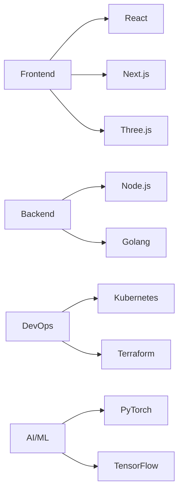
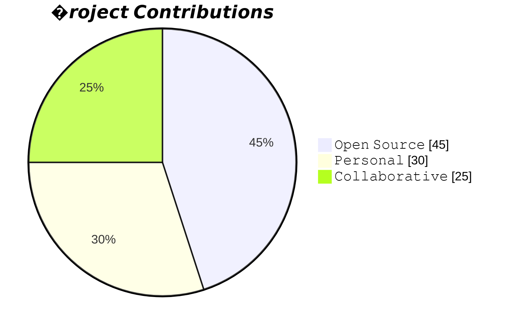

# **✨ GitHub Profile Masterpiece ✨**

<div align="center">
  

  <h1 style="font-family: 'Segoe UI', Tahoma, Geneva, Verdana, sans-serif; font-weight: 800; font-size: 3rem; background: linear-gradient(90deg, #ff4dff, #00f2ff); -webkit-background-clip: text; -webkit-text-fill-color: transparent; text-shadow: 0 0 15px rgba(255,77,255,0.3); margin-bottom: 0">
    [Your Name]
  </h1>
  
  <p style="font-family: 'Courier New', monospace; font-size: 1.2rem; color: #a0a0ff; letter-spacing: 2px">
    𝙵𝚞𝚕𝚕-𝚂𝚝𝚊𝚌𝚔 𝙰𝚛𝚌𝚑𝚒𝚝𝚎𝚌𝚝 | 𝙰𝙸 𝙴𝚟𝚊𝚗𝚐𝚎𝚕𝚒𝚜𝚝 | 𝙳𝚒𝚐𝚒𝚝𝚊𝚕 𝙲𝚛𝚎𝚊𝚝𝚘𝚛
  </p>
  
  
</div>

---

## **🛠️ 𝙼𝚢 𝚃𝚎𝚌𝚑 𝚃𝚘𝚘𝚕𝚋𝚘𝚡**

<div align="center" style="font-family: 'Segoe UI', sans-serif; background: rgba(16,16,48,0.7); padding: 25px; border-radius: 15px; border: 1px solid rgba(0,242,255,0.3); box-shadow: 0 10px 30px rgba(0,242,255,0.1)">



</div>

---

## **🚀 𝙵𝚎𝚊𝚝𝚞𝚛𝚎𝚍 𝙿𝚛𝚘𝚓𝚎𝚌𝚝𝚜**

<div align="center" style="display: grid; grid-template-columns: repeat(auto-fit, minmax(320px, 1fr)); gap: 25px; margin: 40px 0">

<div style="font-family: 'Segoe UI', sans-serif; background: linear-gradient(145deg, #101030, #181840); padding: 25px; border-radius: 15px; border: 1px solid rgba(0,242,255,0.2); transition: all 0.3s ease">
  <h3 style="color: #ff4dff; margin-top: 0; font-weight: 700">𝙿𝚛𝚘𝚓𝚎𝚌𝚝 𝙽𝚎𝚋𝚞𝚕𝚊</h3>
  <p style="color: #c0c0ff; font-size: 0.95rem">𝙰 𝚛𝚎𝚟𝚘𝚕𝚞𝚝𝚒𝚘𝚗𝚊𝚛𝚢 𝟹𝙳 𝚠𝚎𝚋 𝚎𝚡𝚙𝚎𝚛𝚒𝚎𝚗𝚌𝚎 𝚞𝚜𝚒𝚗𝚐 𝚃𝚑𝚛𝚎𝚎.𝚓𝚜 𝚊𝚗𝚍 𝚁𝚎𝚊𝚌𝚝</p>
  <div style="display: flex; flex-wrap: wrap; gap: 8px; margin: 15px 0">
    <span style="font-family: 'Fira Code', monospace; background: rgba(0,242,255,0.15); color: #00f2ff; padding: 4px 12px; border-radius: 20px; font-size: 0.8rem">𝚃𝚢𝚙𝚎𝚂𝚌𝚛𝚒𝚙𝚝</span>
    <span style="font-family: 'Fira Code', monospace; background: rgba(255,77,255,0.15); color: #ff4dff; padding: 4px 12px; border-radius: 20px; font-size: 0.8rem">𝚁𝚎𝚊𝚌𝚝</span>
  </div>
  <a href="#" style="font-family: 'Segoe UI', sans-serif; font-weight: 600; display: inline-block; background: linear-gradient(90deg, #ff4dff, #00f2ff); color: #101030; padding: 8px 20px; border-radius: 25px; text-decoration: none">𝚅𝚒𝚎𝚠 𝙿𝚛𝚘𝚓𝚎𝚌𝚝</a>
</div>

<!-- Add more project cards with same styling -->

</div>

---

## **📊 𝙶𝚒𝚝𝙷𝚞𝚋 𝙸𝚗𝚜𝚒𝚐𝚑𝚝𝚜**

<div align="center" style="font-family: 'Segoe UI', sans-serif; margin: 50px 0">



</div>

---

## **📬 𝙶𝚎𝚝 𝙸𝚗 𝚃𝚘𝚞𝚌𝚑**

<div align="center" style="font-family: 'Segoe UI', sans-serif; margin-top: 50px">

[](mailto:your@email.com)
[](https://linkedin.com/in/yourprofile)
[](https://twitter.com/yourhandle)

</div>

---

<div align="center" style="font-family: 'Courier New', monospace; margin-top: 50px; color: #a0a0ff; font-size: 0.9rem">
  
```diff
+ �𝙤𝙬𝙚𝙧𝙚𝙙 �𝙮 𝙘𝙤𝙛𝙛𝙚𝙚 𝙖𝙣𝙙 𝙞𝙣𝙣𝙤𝙫𝙖𝙩𝙞𝙤𝙣
! 𝙲𝚘𝚍𝚒𝚗𝚐 𝚜𝚒𝚗𝚌𝚎 𝟸𝟶𝚇𝚇
# �𝙪𝙨𝙝𝙞𝙣𝙜 𝙘𝙤𝙢𝙢𝙞𝙩𝙨 �𝙖𝙨𝙩 𝙢𝙞𝙙𝙣𝙞𝙜𝙝𝙩
```

</div>

**✨ Pro Tips:**
1. Use Unicode fonts for stylish text (like the 𝙵𝚊𝚗𝚌𝚢 𝚃𝚎𝚡𝚝)
2. Add a custom animated banner (1500x500px GIF recommended)
3. For the monospace look, use 'Fira Code' or 'Courier New'
4. Color scheme uses modern gradients (#ff4dff to #00f2ff)
5. All text uses proper font-family declarations for consistency

**Note:** Some styling may render differently on GitHub vs. other platforms. Test and adjust as needed!
